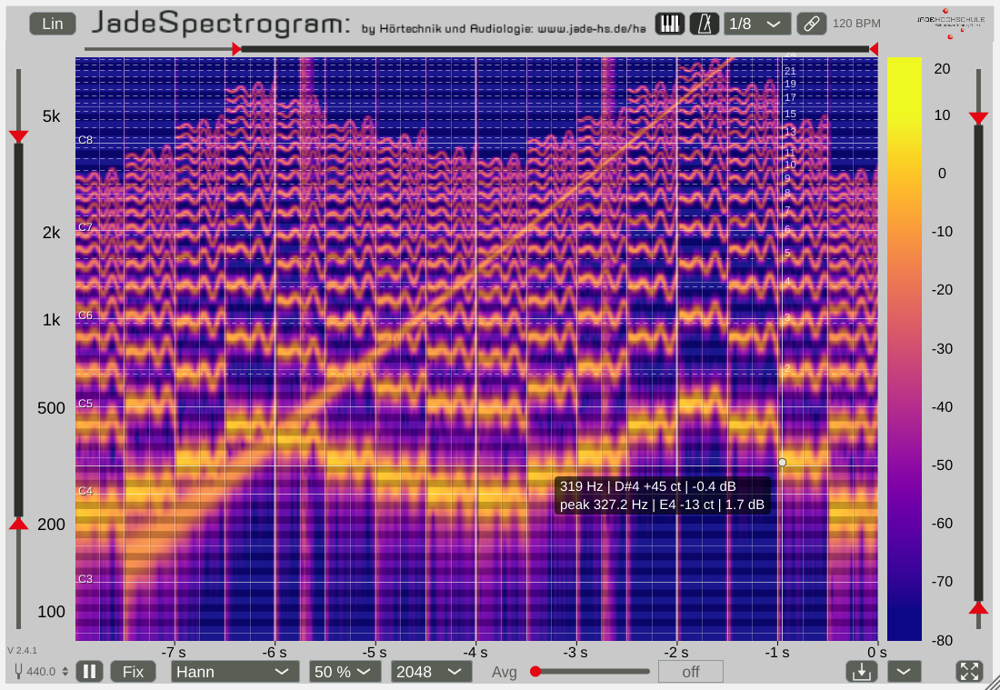
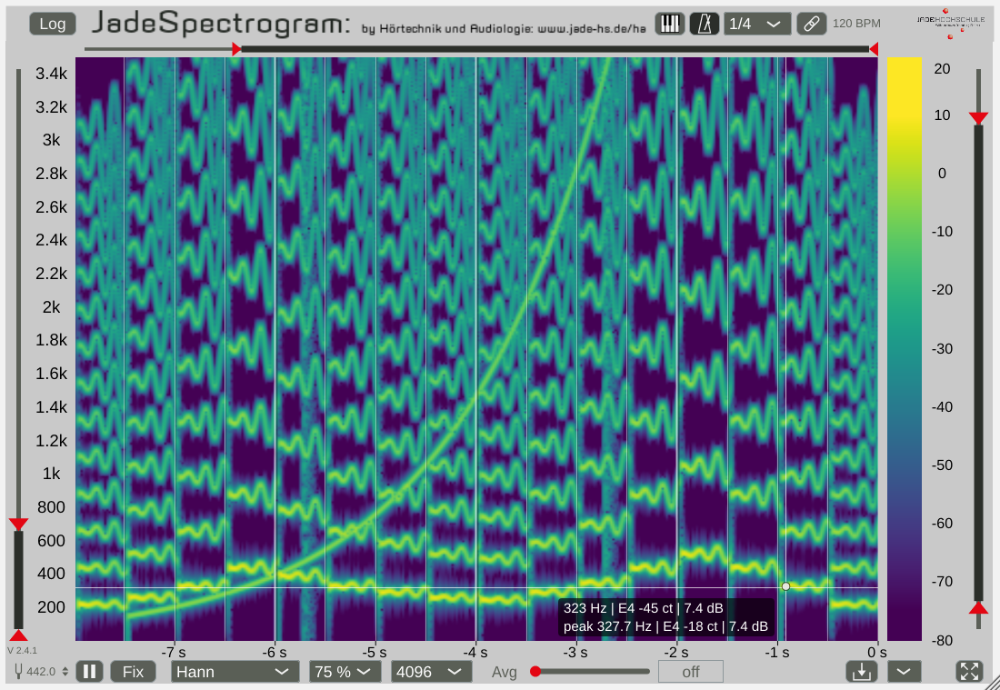

# JadeSpectrogram2

**The musical spectrogram.** A free real-time spectrogram plugin (VST3, AU, Standalone) for
Windows, macOS and Linux that answers not only in Hz and seconds, but in notes, cents and
beats: a keyboard overlay with a free reference pitch, a crosshair that reads note and cents,
the interpolated peak of a partial, a harmonic cursor, and a beat grid from your DAW or with
your own tempo. And you choose the analysis yourself: FFT size, window, overlap, averaging.

Developed at the [Jade Hochschule](https://www.kvraudio.com/developer/jade-hochschule)
(Jörg Bitzer) for teaching and for everyday work in the studio. Free, open source, no
commercial interest. Since version 1.2.2 **developed with an AI** -- see
[How it was made](#how-it-was-made).

| Log axis, keyboard overlay, peak dot and harmonic cursor (Shift) | Linear axis, viridis, beat grid every quarter note, A4 = 442 Hz |
|---|---|
|  |  |

## Download

Binaries for Windows, macOS (Universal: Apple Silicon and Intel) and Linux: on the
[GitHub Releases page](https://github.com/JoergBitzer/JadeSpectrogram2/releases) and on the
[Jade Hochschule developer page at KVR Audio](https://www.kvraudio.com/developer/jade-hochschule),
together with the other free Jade Hochschule plugins. Each zip contains the plugin, the
Standalone application, the [manual](docs/ManualJadeSpectrogram2.pdf), a ReadMeFirst.txt and
the licenses.

The macOS binaries are not signed with an Apple Developer ID yet. If macOS reports that the
plugin is damaged or cannot be opened, remove the quarantine flag in the Terminal, e.g.
`xattr -cr ~/Library/Audio/Plug-Ins/VST3/JadeSpectrogram2.vst3`.

Install by copying the plugin into your plugin folder and rescanning in your DAW:

| | VST3 | AU |
|---|---|---|
| Windows | `C:\Program Files\Common Files\VST3\` | -- |
| macOS | `~/Library/Audio/Plug-Ins/VST3/` | `~/Library/Audio/Plug-Ins/Components/` |
| Linux | `~/.vst3/` | -- |

The Standalone version runs without a DAW and analyses the input of your sound card.
JadeSpectrogram2 installs next to the old JadeSpectrogram (different name and plugin ID), so
projects that use the old version keep working.

## Features

### Notes and cents

- **Keyboard overlay:** a transparent piano roll over the spectrogram, one band per semitone
  (a quarter tone below to a quarter tone above the note), note names at every C and at every
  note when you zoom in.
- **Reference pitch A4** from 380 to 480 Hz (default 440): 415 Hz for baroque pitch, 442/443 Hz
  for most orchestras. Overlay and readout follow it.
- **Crosshair** with frequency, note, deviation in cents and level at the mouse
  (`441 Hz | A4 +4 ct | -51.8 dB`), and a second line with the **peak**: the strongest maximum
  in the note band of the mouse, interpolated between the bins and marked by a dot
  (error a few hundredths of a bin, below 1 cent above about 200 Hz at FFT size 4096/8192).
- **Harmonic cursor:** hold Shift for lines at 2, 3, 4, ... times the frequency of the peak --
  which partials belong to a note, how far they reach, how inharmonic a string is.

### Bars and beats

- **Beat grid** from the tempo and position of your DAW: bar lines, beats and note values
  (1/2 ... 1/16, counted from the bar start as in a DAW grid), exact also after tempo changes,
  jumps and loops.
- **Free tempo** for tempo analysis of any recording: switch the chain button to "free", pause,
  Alt+click on a downbeat and drag the BPM value until the lines sit on the onsets. Works with a
  stopped transport and in the Standalone.

### The analysis

| Setting | Values |
|---|---|
| FFT size | 512, 1024, 2048, 4096, 8192 |
| Window | Rectangular, Hann, Hamming, Blackman-Harris, Flat Top, Hann-Poisson |
| Overlap | 50 % or 75 % |
| Averaging | off, or an exponential time constant up to 2 s |
| Frequency axis | linear (every bin exactly at its frequency, maximum per pixel row) or logarithmic |

Changing a setting while the audio runs causes no dropouts. **Zero latency:** the plugin is a
pure analyzer, the audio passes through unchanged, so it can sit anywhere in the chain. The
level is the power spectral density in dB (relative to digital full scale).

### The display

Range sliders for frequency, colour (-80 ... +20 dB) and time (10 s memory with zoom), an
overview button back to the full range, time axis in seconds, scrolling or fixed image with a
running cursor, pause, seven colourmaps (including the perceptually uniform, colour-blind
friendly viridis and plasma), PNG export of the visible spectrogram with its axes, scalable GUI
(drag the corner). All settings are saved with the DAW project.

### CPU load

Measured on a Ryzen 7 5850U (Linux, Release build): the analysis takes 0.14 % of one core at
FFT size 2048 and at most 0.4 % (8192, 75 % overlap). Drawing the display costs much more,
about 8 % of one core at the default window size and 25 frames per second (everything on:
9 %), but only while the window is open, and never in the audio thread.

## How it was made

The first versions of JadeSpectrogram (1.0, with the Eigen library) and JadeSpectrogram2
(1.1 -- 1.2.1, the new code base with the fast FFT by Uwe Simmer) were written by Jörg Bitzer.
**Since version 1.2.2 (September 2026)** the code was written by an AI, Anthropic's Claude
(in Claude Code, model Claude Opus 5.5), in conversation with Jörg Bitzer -- but not in the
"one prompt, ship the result" way:

- **A review and a plan first.** A code review of 1.2.4 (real-time safety, bugs, ideas), then
  an agreed plan for version 2.0 with decisions and a target layout
  ([planning.md](planning.md)).
- **Interactive, step-by-step development.** One feature or fix at a time, each on its own git
  branch with its own version number, explained, reviewed in a DAW and merged only on the
  human's go -- about 50 commits from 1.2.2 to 2.4.1, each described in its commit message and
  in the release notes of the manual.
- **Human review.** Every step was installed and tried; the review comments changed the
  behaviour and the GUI (for example the beat grid in note values, the peak readout as a second
  line next to the value under the mouse instead of replacing it, the icons, the slider look).
- **Meticulous testing by the AI:**
  - [pluginval](https://github.com/Tracktion/pluginval) at strictness level 10, five runs per
    change locally, and in CI on all three systems before every release (plus Apple's `auval`
    for the AU);
  - a fingerprint (hash) of all analysis results for a fixed signal, unchanged by every
    refactor since 1.3;
  - a counter for memory allocations in the audio thread (always zero) and thread sanitizer
    runs of the data exchange between audio and display;
  - offscreen renders of the real editor and pixel-exact checks: grid lines at their beat
    times, band edges of the overlay at the quarter-tone boundaries, readout = band, peak
    accuracy with sine signals, synthetic mouse drags for every slider and box, state save and
    restore;
  - latency measured with impulses, an FFT benchmark (`tester/fftBenchmark`), CPU
    measurements of the display.

What this does not replace: there was no formal user study, and the hands-on tests during
development were done on Linux -- the Windows and macOS builds are checked by pluginval and
auval in CI. Feedback and bug reports are welcome.

## Build from source

The plugin uses [JUCE 9](https://juce.com) (9.0.3) and CMake. JUCE and
[TGMStaticLib](https://github.com/JoergBitzer/TGMStaticLib) (only its FFT is compiled) are git
submodules, so everything needed is in this repository:

```console
git clone --recursive https://github.com/JoergBitzer/JadeSpectrogram2.git
cd JadeSpectrogram2
cmake -S . -B build -DCMAKE_BUILD_TYPE=Release
cmake --build build --config Release --target JadeSpectrogram_VST3 JadeSpectrogram_Standalone
# macOS additionally: --target JadeSpectrogram_AU
```

The results are in `build/JadeSpectrogram/JadeSpectrogram_artefacts/Release/`. On Linux,
install the JUCE dependencies first (see `JUCE/docs/Linux Dependencies.md`; the list used for
the release builds is in `.github/workflows/release.yml`). Test a build with
`tools/run_pluginval.sh <path to the .vst3> [runs]` (Windows: `tools/run_pluginval.ps1`).
The tests of the plugin code are built with `-DJADE_BUILD_TESTS=ON` and run with `ctest`
(Linux/macOS, see [tester/README.md](tester/README.md)).

To update JUCE: `cd JUCE && git fetch --tags && git checkout <version>`, then commit the new
submodule state.

**Releases** are built by GitHub Actions ([.github/workflows/release.yml](.github/workflows/release.yml)):
pushing a tag `vX.Y.Z` that matches the version in `JadeSpectrogram/CMakeLists.txt` builds
Windows, macOS and Linux, tests every build with pluginval (and auval on macOS) and creates a
GitHub release with the zips. "Run workflow" on the Actions page builds without releasing.

## For students and developers

| Folder / file | Content |
|---|---|
| [JadeSpectrogram/](JadeSpectrogram/) | the plugin: `JadeSpectrogram.h/.cpp` (parameters, analysis `JadeSpectrogramAudio`, GUI `JadeSpectrogramGUI`), `SpectrumAnalyzer` (windowed FFT, overlap), `TwoDimBlockFreeFiFo` (lock-free exchange audio -> GUI), `RangeSlider.h`, `DragValueBox.h`, `IconButton.h`, `CColorpalette` (colourmaps) |
| `JadeSpectrogram/tools/` | `SynchronBlockProcessor` (fixed-size blocks, with an *Analyze* mode: zero latency), parameter and preset helpers |
| [tester/](tester/) | the plugin tests (`pluginTests`, run with `ctest`, see [tester/README.md](tester/README.md)), `fftBenchmark` (internal FFT against JUCE's FFT), `spectrumAnalyzerTester` |
| [tools/](tools/) | `run_pluginval.sh` / `.ps1` |
| [docs/](docs/) | the [manual](docs/ManualJadeSpectrogram2.pdf) (all controls, release notes) and the screenshots |
| [planning.md](planning.md) | the code review, the plan for 2.0 and the future ideas |
| `release/ReadMeFirst.txt` | installation notes for the zips |

Two things worth a look if you write your own analyzer: how the audio thread hands the spectra
to the GUI without a lock (each slice carries its size, hop and musical position, so the GUI
always knows what it got), and how the *Analyze* mode of `SynchronBlockProcessor` analyses in
fixed blocks without delaying the audio.

## License

- **Source code of this repository: [MIT License](LICENSE)**, (c) Jörg Bitzer, Jade Hochschule.
- **Plugin binaries:** they contain third-party code:
  - [JUCE 9](https://github.com/juce-framework/JUCE), used under the
    [AGPLv3](https://www.gnu.org/licenses/agpl-3.0.html) (JUCE is dual-licensed
    AGPLv3 / commercial JUCE licence). Therefore the binaries as a whole are
    distributed under the **AGPLv3** (full text: [LICENSE-AGPL-3.0.txt](LICENSE-AGPL-3.0.txt));
    the complete source code is this repository plus JUCE.
  - the VST3 SDK 3.8 by Steinberg (bundled with JUCE 9; MIT License) -- VST is a
    registered trademark of Steinberg Media Technologies GmbH;
  - the Audio Unit SDK by Apple (Apache License 2.0, macOS AU only);
  - the FFT by Uwe Simmer in [TGMStaticLib](https://github.com/JoergBitzer/TGMStaticLib)
    (MIT-style license) and the colormap data of matplotlib (viridis, plasma, inferno; CC0).

MIT code may be combined with AGPLv3 code; the MIT license of the files in this repository
stays as it is, and anyone can reuse them under MIT (for example in a project with a
commercial JUCE licence). The manual is licensed under CC-BY 4.0.

The plugin comes without any warranty (see the licenses).
